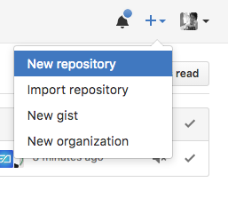
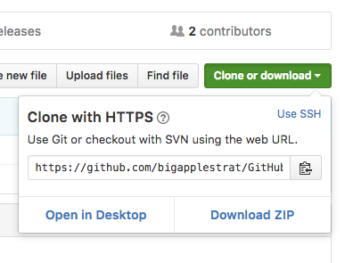
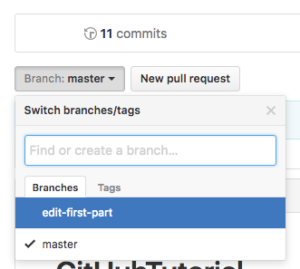
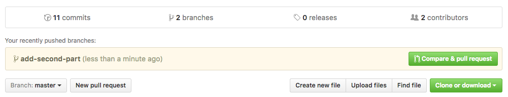
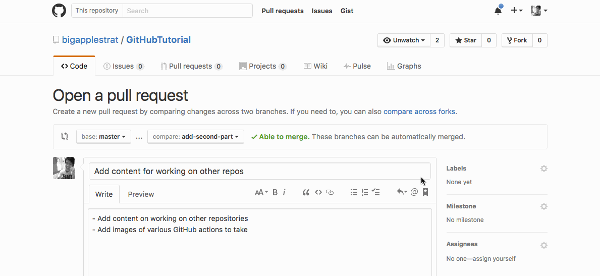

# GitHubTutorial

## Objectives

- Learn what `git` and version control are
- Learn basic `git` commands
- Play around with learned `git` commands
- Learn some `git` tips and tricks

## Prerequisites

- A computer (Mac, Linux, Windows)
- Installation of `git`

## Outline

- [What is version control and git?](#what-is-version-control-and-git)
- [How do you start a git repository?](#how-do-you-start-a-git-repository)
- [I've made changes, do they go to GitHub? What are remotes?](#ive-made-changes-do-they-go-to-github-what-are-remotes)
- [I want to make more changes. How does git know what's different?](#i-want-to-make-more-changes-how-does-git-know-whats-different)
- [I immediately regret this decision. Revert.](#i-immediately-regret-this-decision-revert)
- [What if I screw up real bad? Can I erase history?](#what-if-i-screw-up-real-bad-can-i-erase-history)
- [I like some files more than others. Do all files need to be tracked?](#i-like-some-files-more-than-others-do-all-files-need-to-be-tracked)
- [How do you start working on someone else's repository? Fork it.](#how-do-you-start-working-on-someone-elses-repository-fork-it)
- [You don't wanna mess up your fork right? Make a clone instead.](#you-dont-wanna-mess-up-your-fork-right-make-a-clone-instead)
- [Branch out to make changes (in the world). Then commit!](#branch-out-to-make-changes-in-the-world-then-commit)
- [Respectively request your changes with a little pull](#respectively-request-your-changes-with-a-little-pull)
- [Exercises/Playground Time](#exercisesplayground-time)
- [Git Tips and Tricks](#git-tips-and-tricks)
  - [GitHub GUI](#github-gui)
  - [The README.md File](#the-readmemd-file)
  - [Stashing away changes for just a bit](#stashing-away-changes-for-just-a-bit)
  - [Fixing the last commit message](#fixing-the-last-commit-message)
  - [Creating git version controlled RStudio project](#creating-git-version-controlled-rstudio-project)
  - [Create a multi-line commit message and see changes made](#create-a-multi-line-commit-message-and-see-changes-made)
  - [gitignore on specific directories](#gitignore-on-specific-directories)
- [Resources](#resources)

## What is version control and git?

Writing code can be a messy process. When working on your code, you make many decisions over long periods of time. Files and lines of code are deleted and replaced, functions are changed, the structure of your programs are rewritten and refactored. All of these changes can have unintended consequences. Wouldn't it be great to undo them? Or just to remember why on earth you made that weird function in the first place?

Well commented code can solve many issues, but tracking changes over time is a valuable tool that allows coders to see how a project has evolved without resorting to confusing schemes that force you to remember if `newproject-definitelythefinalversionimprettysure1.py` was the last one that you got working correctly or if that was number 2.

Problems of this sort only become more complex when working on teams of coders. With many chefs in many kitchens, it can be difficult to figure out why a large project is no longer working the way it should. Many changes to different parts of a codebase can add up over time, and often the left hand doesn't know what the right hand is doing.

Version control systems allow you the ability to track and manage changes to code over time. They give a picture of how code evolves, give projects control over how to accept or reject changes, and allow the ability to undo destructive changes and start from the last time everything was working correctly.

`git` is a specific variety of version control that provides a set of commands allowing versions of code to be incorporated into a history (repository) that tracks what changes have been made over time, and also allows collaborative coding efforts. `git` shouldn't be confused with GitHub. [GitHub](http://www.github.com/) is a repository hosting service that can store your code histories and allow you to distribute them easily, but it is not the only hosting service. `git` repositories can also be hosted by other companies like [BitBucket](https://bitbucket.org/), or stored on a local machine on your own network.

## How do you start a git repository?

There are many graphical user interfaces for interacting with `git`, but intitially we are going to focus on the Unix command line version. The command line tools are more consistent across platforms and are much more explicit about what they are doing. For our purposes today, we will be using GitHub as the main repository host.

First you will need to set up a user account and password on GitHub. Once you have done so, click the `+` sign in the upper righthand corner of the page and choose to create a new repo. Call it `exampleRepo`.



You can add a description if you feel like it. When you're done, click on "Create Repository".

Now that we have created the repo on the hosting service, the next step is to find a place to work on your computer.

Navigate to the directory you would like to store your git repositories. The new repo will be saved as a subdirectory of that folder. Create a folder named `exampleRepo` and then navigate to the new directory. Type the following into your terminal:

```sh
echo "# exampleRepo" >> README.md   # create a new file
git init                            # initialize git repository
git add README.md                   # stage file to be committed
git commit -m "first commit"        # actually commit file to version history
```

This block of code first creates the `README.md` file, giving us our first file to commit to our repository. We then run `git init` in order to create a file that tells git that the current directory is a repository. We then add the `README.md` file to the files we would like to track changes on using `git add`. Finally we make our first commit, and add our changes to the repo history.

## I've made changes, do they go to GitHub? What are remotes?

So far nothing has been added to the remote GitHub repo. All the changes still reside on your own computer. Next do the following:

```sh
git remote add origin https://github.com/YOURUSERNAME/exampleRepo.git
git push -u origin master
```

This tells `git` that we want to refer to this repository as `origin` when we commit additional information. The `git push` command sends your data off to GitHub. You should be prompted for your username and password. The master command tells git that you are pushing the master branch, which will make more sense later.

**Note**: You can type `git remote -v` to see all the current remote repositories git has references to.

If you're not using GitHub as your hosting service, you would simply give a different remote alias specific to that site. The convention of where the username and repo details go might be slightly different, but the process should be the same.

If you open the repository on `github.com` you should now see that your `README.md` file has been added to the repository.

## I want to make more changes. How does git know what's different?

Let's see what happens when you change something in the file. Open the `README.md` file in a text editor and replace its text with the following.

```markdown
# Some new text here

Spam and eggs.
```

There's a really handy `git` command called `git diff` that'll help remind you what has changed. You can think of it as how `git` keeps track of what has changed. This might not be useful now, but with larger projects, this can be helpful.

This command will show you which files are different and how they've changed since the last time you committed in your repository. We can see that the initial line of text was deleted and that the new text was added below it.

```sh
git diff
```

You should see something similar to this. It can look messy but the most useful parts are at the bottom showing you the difference.

```diff
diff --git a/README.md b/README.md
index 37b190f..d215334 100644
--- a/README.md
+++ b/README.md
@@ -1 +1,3 @@
-# exampleRepo
+# Some new text here
+
+Spam and eggs.
```

Once everything looks good, we can perform a new commit.

```sh
git add README.md
git commit -m "made some changes"
```

The `-m` flag allows you to add comments that will be tracked with each new commit.

```sh
git push -u origin master
```

## I immediately regret this decision. Revert.

We've now pushed the new version of the file to the repository. If you navigate to your GitHub repo, you should be able to click on the individual file, then click on history. From here you can view the individual changes that were made in this commit. Deleted code shows as red, and added code shows as green.

But shoot. Maybe looking at this new commit you really regret your choices. "Am I really the kind of person who makes coding-related Monty Python references?" you may say to yourself. "No. We have to forget this ever happened."

To return to an earlier version of your code, we perform what's known as a `rollback`. This effectively returns the files that have been changed to their previous state. Type the following into the terminal:

```sh
git log  # go back in time!
```

The `git log` lists the commits you've made to the repository in the past by ID and gives you the comments you saved along with them.

We want to go back to the good old days. Back when we just had a simple headline in our `README.md` file. Note the ID after the most recent commit, and enter it in the following command. The ID is a long string of 40 characters unique to each commit.

```sh
git revert yourCommitIdGoesHere
```

You should be prompted to enter a commit message to explain why you have such a terrible sense of humor. Submit and continue.

If all has gone according to plan. Inspecting the `README.md` file should show that it's been returned to its original state. Enter `git log` again and notice that you did not delete the previous commit. Instead we committed a new change which undoes what was typed in the previous changes. Your love of 1970s British comedy troupes remains in the official record, though the actual code in the current version shows no trace.

Go ahead and do the following to push your changes to GitHub.

```sh
git push -u origin master
```

## What if I screw up real bad? Can I erase history?

It is possible to totally delete the chain of records in a repository by using the `git reset` command, but this is a kind of nuclear option and is often heavily discouraged in group environments since it effectively destroys the commits that you are reverting past.

For that reason we recommend using `git revert` whenever possible, since it maintains the overall project history and prevents loss of data. 

## I like some files more than others. Do all files need to be tracked?

There are a few tricks that can help make your time with `git` a little less painful. Git includes a number of configuration files. The one you'll probably be the most involved with is `.gitignore`. This file lives in your project's main directory and is a list of files that you would like to prevent from being synced along with the rest of your code. For example, if you have a terabyte of high resolution Nicolas Cage headshots in your directory it's probably a good idea not to send those to the GitHub servers. You monster. Try the following...

```sh
# Create a new file
ls > exampleFile.example

# Note the output here
git status

# Create your .gitignore file
touch .gitignore

# Add a new exclusion criteria to your .gitignore file
echo "*.example" >> .gitignore

# Ping git status again
git status
```

You should notice that once you create the `.gitignore` file, `git` begins ignoring any file ending with the `.example` file extension. This process works for any file type.

The `.gitignore` file is like any other file, so we need to add it to our commit path and push it to the remote server in order to check it into the repository.

```sh
git add .gitignore
git commit -m "Add .gitignore file"
git push -u origin master
```

Your git repository will now exclude these filetypes until you modify the `gitignore` file to allow them through.

## How do you start working on someone else's repository? Fork it.

You will inevitably work on a version controls project in the future. So it is
useful to know how to work on someone else's version controlled project.

First, find a repository to work on, such as this one. Visit this tutorial if
aren't already reading it on GitHub.

```
https://github.com/bigapplestrat/GitHubTutorial
```

To contribute work on this repository, you'll first have to make a copy of the
repository by **forking** it. You can find the "Fork" button near the top of
the GitHub page, along with the "Watch" and "Star" buttons.


## You don't wanna mess up your fork right? Make a clone instead.

Once you have a fork of this repository. You'll need make a copy of this on
your own computer to make your changes.

Find that folder where you keep your `git` repositories, or find some place you
intend to have this project in. You'll need to then make a copy of your fork of
the project on your computer by making a **clone** of it.

Click on the "Clone or download" button to find the `git` link to clone.



Copy that address and then go to your terminal and type the following.

```sh
git clone https://github.com/bigapplestrat/GitHubTutorial.git
```

This will now create a folder `GitHubTutorial/` wherever your terminal was.

Cloning your fork will get all the changes recorded in this project up to the
point where you forked the project.

## Branch out to make changes (in the world). Then commit!

Before you make any changes, you'll want to safely make changes without messing
up this amazing repository, right?

To safely make changes here and in the future, you'll want to create your own
path of changes with a **branch**. This preserves the changes made so far, but
allows you to make changes without forgetting what you started with.

If you have a ton of ideas, you might want to have multiple branches, each with
its own unique changes. You can take a look at your branches using `git
branch`.

```sh
git branch
```

You shouldn't have any branches besides the `master` branch. The `master`
branch is the main branch that should always work.

To make new branches, you can type one of the following commands.

```sh
# branching method 1
git checkout -B new-branch

# branching method 2
git branch new-branch
git checkout new-branch
```

Both do the same thing, which is create a new branch and go onto that new
branch.

The `git checkout` command in general is what you will use to switch between
branches you may have. Here is how you would switch back to the `master` branch.

```sh
git checkout master
```

But let us get back to making so cool changes.

```sh
git checkout new-branch
```

You'll now want to make some changes and commit them as usual.

```sh
echo `date` >> todaydate.txt        # make new file/changes
git add todaydate.txt               # stage changes to be committed
git commit -m "Add today's date"    # commit new changes
git push origin new-branch          # push changes to your fork
```

The last command here pushed your changes up to your fork. So if you go to your
fork of this project, you can see your changes after you switch to your
`new-branch`. You can find how to change branches on GitHub by clicking on the
button that says "Branch: master". It will then show you all the branches that
you can see. Below, is how it would look if you had a `master` and
`edit-first-part` branch.



## Respectively request your changes with a little pull

You've now many awesome changes and you now want to share those changes with a
project. To do so, you'll need to make what is called a **pull request**, also
known as a **PR**.

GitHub makes this very easy because once you're pushed a branch from your fork,
visiting the original project page, you can see something new.



Click on "Compare & pull request" to start the pull request. You should be
greeted with a similar screen.



The top is information about your pull request with a title and message, if
you've added one. If you scroll down, you can see the changes you've made. If
you're satisfied with the changes, go on ahead and click on the green "Create
pull request" button and wait for your pull request to be accepted!

## Exercises/Playground Time

Here's a time to reflect on what you've learned so far and play around more
with `git` commands if you so choose.

You can apply this exercise to your example project we created at the beginning
or, if you're up for it, you can make a pull request to this repository and we
can see the process of merging changes. There are sum spelling mistaks in
hear :wink:

- How do u create a new git repository? Remember?
- Create a file too track or make som changes.
- How do you check the statis of your git repository?
- What changes have been mad to your repository?
- Stag your file. What does staging mean?
- Check the status of your repository.
- Vommit your changes with a nice massage.
- How do you check your commit history?

## Git Tips and Tricks

### GitHub GUI

There are a number of graphical interfaces for interacting with `git`. GitHub produces their own GUI which is available [as a download from their site.](https://desktop.github.com/) If the command line isn't for you, it offers a majority of the functionality of the command line interface and simplifies the process of commenting and tracking changes by providing a visual display.

### The README.md File

You may have noticed that we did a lot of playing with this file during the initial segment of the training. The `README.md` file is a markdown file that will automatically be displayed on your GitHub repository's page.

You may have noticed that this very tutorial is written on a `README.md` file. Markdown is a [very flexible convention](https://github.com/adam-p/markdown-here/wiki/Markdown-Cheatsheet#links) that allows you to make readable pages explaining the way that your code works in order to inform your users about how to use your programs.

Not only that, markdown files can be converted into many, many other markup
formats using [pandoc](http://pandoc.org/), the universal document converter.

### Stashing away changes for just a bit

If you made some changes, but need to change a branch or, say, pull down
updates from your remote, you can use `git stash` to temporarily "stash" away
changes until later.

```sh
echo "# New file" >> newfile.md
git stash   # stash changes under your bed or rug
git status  # there's nothing there!
...
git stash apply  # find your changes and add them back
```

### Fixing the last commit message

If you need to edit the last commit message, you can run the following.

```sh
git commit --amend
```

This also comes in handy if you forgot to make changes in a file and want to
add it to your previous commit.

```sh
...  # make some changes
git add file-you-changed.md
git commit --amend
```

### Creating git version controlled RStudio project

RStudio has [a page][rstudio] talking about just this!

[rstudio]: https://support.rstudio.com/hc/en-us/articles/200532077

### Create a multi-line commit message and see changes made

Sometimes when you commit a change, you might have forgotten what you even
changed! If you use the verbose commit with a `-v` or `--verbose` flag, you can
scroll through the changes and make a better commit message to describe all
that happened in that change.

```sh
git commit -v
```

### gitignore on specific directories

The `.gitignore` file works by affecting the directory it lives in and any subdirectories nested inside that directory. For this reason, your main `.gitignore` file should live in your root directory. However there might be cases where you wish to exclude a certain kind of files in one subdirectory or another. You can achieve this by creating a new `.gitignore` file in the subdirectory of interest. For example, if you have a `credentials` subdirectory with passwords and other credentials saved in plaintext form, but you wish to sync text files in other directories, you can create a new `.gitignore` in the `credentials` directory with the line `*.txt` inside of it. From this point on, `git` will sync text files from all other directories, but leave your dirty secrets alone as long as they're in the `credentials` directory.

You can also use `.gitignore` files if you wish to have a permanently empty directory - for example, if it's a place that users will be putting their own data. Simply initialize the `.gitignore` file in the directory you wish to remain empty and push the change. The directory should now be added like any other file despite being empty.

## Resources

- [Oh shit, git!](http://ohshitgit.com/)
- [Atlassian git Tutorials](https://www.atlassian.com/git/tutorials/)
- [Pro Git Book](https://git-scm.com/book/en/v2)
- [Ten Simple Rules for Taking Advantage of Git and GitHub](http://dx.doi.org/10.1371/journal.pcbi.1004947)
- [giteveryday - A useful minimum set of commands for Everyday Git](https://www.kernel.org/pub/software/scm/git/docs/giteveryday.html)
